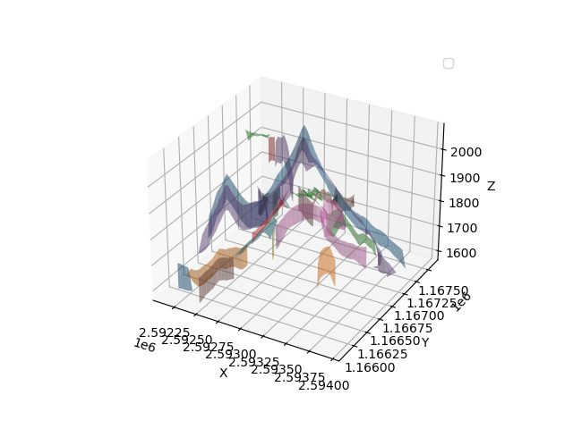
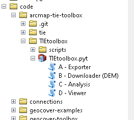
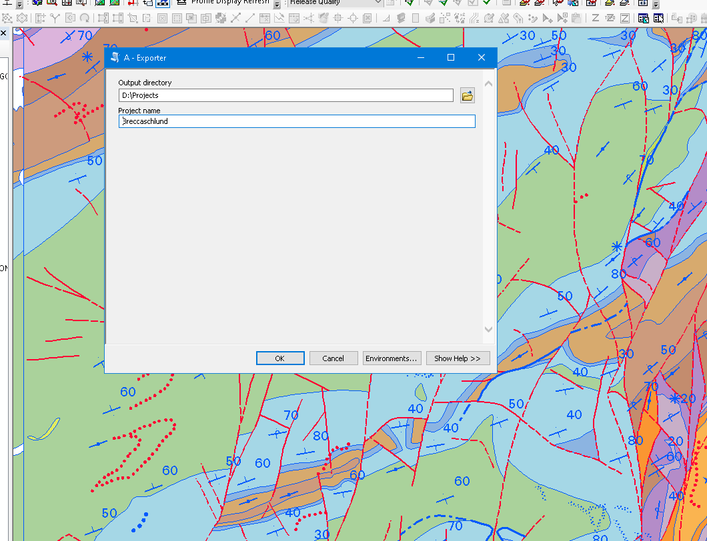
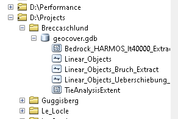
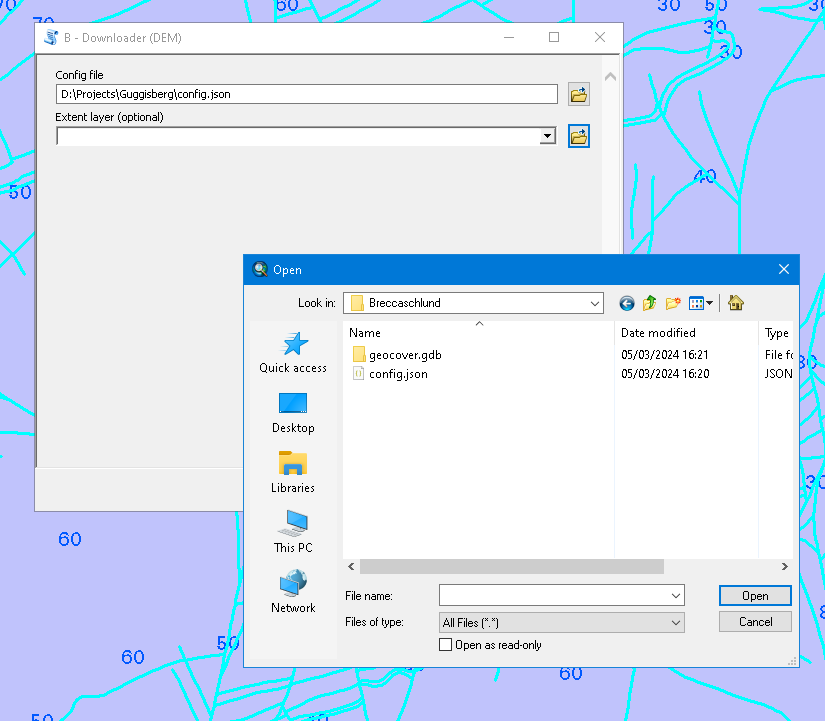
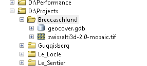
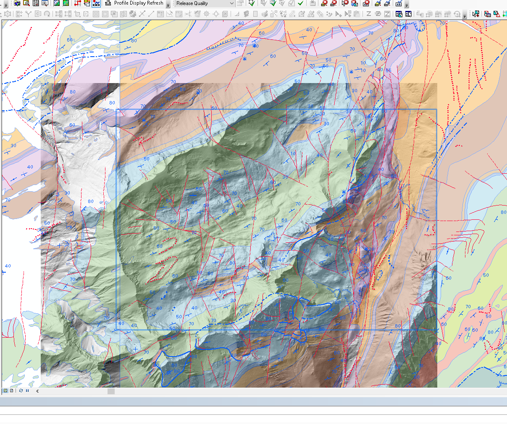
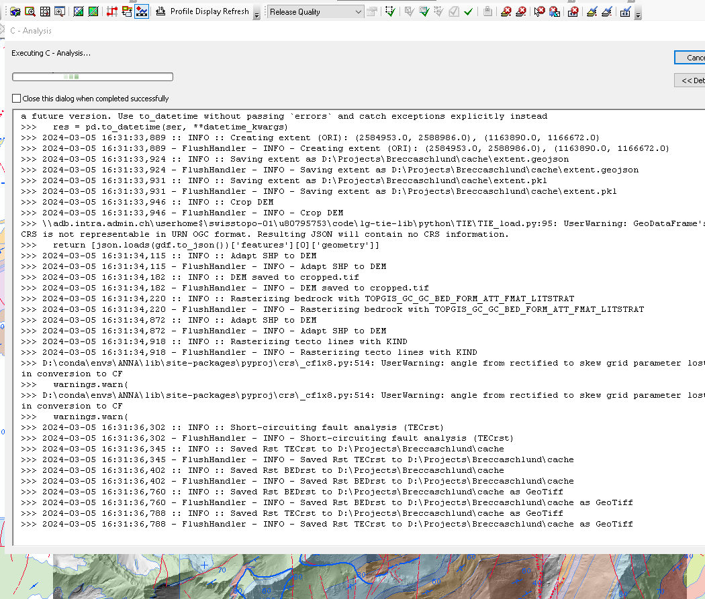
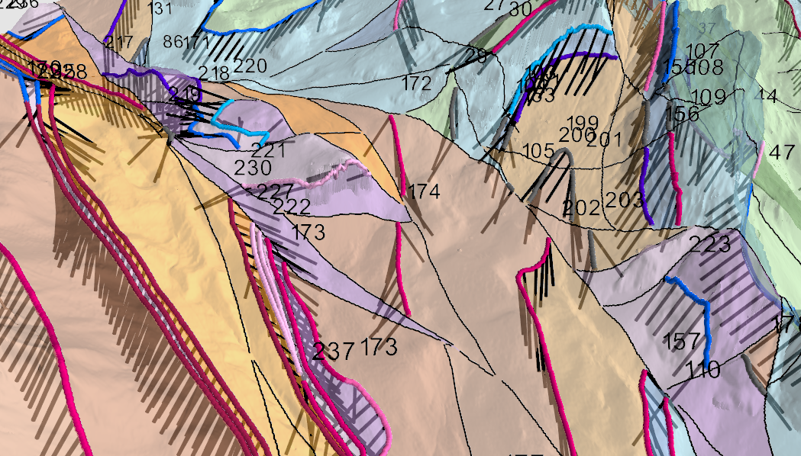

TIE Analysis
============

Basic ESRI ArcMap's Toolbox to perform Trace Information Extraction (TIE) Analysis.

Installation
------------

Basically, this is an ESRI ArcMap/ArcGis Pro ToolBox (Python2.7 and Python 3.9) running external scripts using `Python3`.

The `install.py` script is very `swisstopo`specific, it basically:

 * Create a `.condarc` in the `$HOME`directory ( _H:\_ )
 * Set up a `geocover.ini` file in the `$HOME\local\geocover` directory. Check the variables
   `tie_conda_env` and `proxy`for corectness.
 * Create a `conda` environment in `D:\conda\envs\TIE`
 * Map the drive `T:` to a conda environment on the `LgX`

Conda
-----

On the Citrix VDI and the  BURAUT laptop, the only Python3 available is the one 
of the  ESRI ArcGis Pro _C:\Program Files\ArcGIS\Pro_ installation.

There are several limitations:

 * You cannnot modify the default `argispro-py3` conda environment. You may only clone it.
 * On BURAUT, you only have a C:\ drive and may only write to _C:\LegacySW_
 * On the VDI, you have C:\ and D:\ and may write almost everywhere. 
 * Calling any `conda env` from within `ArcGis Pro` will pollute the _sys-path_ with the default environment variables.

Creating a conda env from scratch (takes about 2 hours). The command will create a new env
_D:\conda\envs_

    H:\code\bitbuckets\arcmap-tie-toolbox> setup_conda_environment.cmd TIE

Use the network env on the _LgX_ server, mapped on _T:\_

    H:\> activate T:\TIE

Clone the same environment (takes 30 minutes)

    H:\code\bitbuckets\arcmap-tie-toolbox>  clone_conda_environment.cmd TIE

---
**NOTE**

As there are no `arcgis` and `arcpy` modules in this environnement, it's labelled as `broken`by ArcGis Pro.
---

Additionnally, you may try to speed up to subsequent install by using `mamba`:

   conda install mamba
   mamba install ipycytoscape

You may then `activate` your conda environnement:
   
    C:>argis-pro-py3> deactivate

    activate ANNA

Install modules

Linux:

    python -m pip install 'geocover-utils @ git+https://bitbucket.org/procrastinatio/geocover-utils.git@0.1.1'

Windows:
    python -m pip install --trusted bitbucket.org  https://bitbucket.org/procrastinatio/geocover-utils/get/master.zip

    python -m pip install --trusted bitbucket.org  https://bitbucket.org/procrastinatio/lg-tie-lib/get/packaging.zip

TODO: add the `geocover-utils` and `traces-extraction` libraries

Copy the `geocover.ini` configuration to `H:\local\config\geocover`

 "C:\Program Files\ArcGIS\Pro\bin\Python\Scripts\conda.exe" create -p D:\conda\envs\EMPTY_FROM_YAML -v --override-channels -c conda-forge -y --show-channel-urls python=3.9.18 conda pip setuptools 

### Python2

Install `Python2` deopnedecies

     H:\> C:\Python27\ArcGIS10.8\Scripts\pip.exe install psutil

     H:\> C:\Python27\ArcGISx6410.8\Scripts\pip.exe install psutil

### Create a `conda` with mayavi and arcgis

Create a bare mininal environment for python 3.9

    H:\code\arcmap-tie-toolbox> "C:\Program Files\ArcGIS\Pro\bin\Python\Scripts\conda.exe"  create  -p C:\legacySW/EMPTY -v --override-channels -c conda-forge -y --show-channel-urls mamba python=3.9.18

Install the ESRI stuff

    H:\code\arcmap-tie-toolbox> "C:\Program Files\ArcGIS\Pro\bin\Python\Scripts\conda.exe"  install -p C:\legacySW/EMPTY -v -c conda-forge  -c esri  -y --show-channel-urls arcgis arcpy

Add the usefull stuff

    H:\code\arcmap-tie-toolbox> "C:\Program Files\ArcGIS\Pro\bin\Python\Scripts\conda.exe"  install -p C:\legacySW/EMPTY -v -c conda-forge  -c esri geocube geopandas matplotlib mayavi numpy rasterio scipy "shapely>=2.0.0"  scikit-image dask

Extract the package list (full source url)

    H:\code\arcmap-tie-toolbox> "C:\Program Files\ArcGIS\Pro\bin\Python\Scripts\conda.exe" list  --explicit -p C:\legacySW\EMPTY >h:\EMPTY__list_export.yaml

On the *VDI* recreate the environment with:

    "C:\Program Files\ArcGIS\Pro\bin\Python\Scripts\conda.exe" create   -p D:\conda\envs\EMPTY   --file  EMPTY__list_export.yaml

### Python3

Modules to install in a fresh `env`

    conda install geocube geopandas matplotlib mayavi numpy rasterio scipy "shapely>=2.0.0"  scikit-image dask

Update in an `ArcGis Pro` if cloning (in theory)

    conda install --name ARGISTIE  --channel conda-forge geocube geopandas mayavi  rasterio "shapely>=2.0.0"  scikit-image 

## Build 

    (c:\LegacySW\build-distribute) H:\code\arcmap-tie-toolbox>conda build --debug  recipe -c esri -c conda-forge

## TIE

Using a `dask` pipeline

Exporting TIE Analysis to GeoJSON or KML

## Usage

Select an area (a few square kilometers, around 1:10'000 or bigger, no sheet border!)

GDB structure

Download DEM and create a mosiac

New Mosic file

Hillshade from DEM mosaic (only for demo)

TIE Analysis

Takes about 10-15 minutes for 5 km2

3D View and TIE Analysis

[map.geo.admin.ch (3D)](https://s.geo.admin.ch/3k4ctm9jhzdn)

        
    
    https://dubious.cloud/TIE/data/Kaiseregg/2.0/tie_as_multilines_under.kml 
    https://dubious.cloud/TIE/data/Kaiseregg/2.0/tie_as_lines_under.kml 

